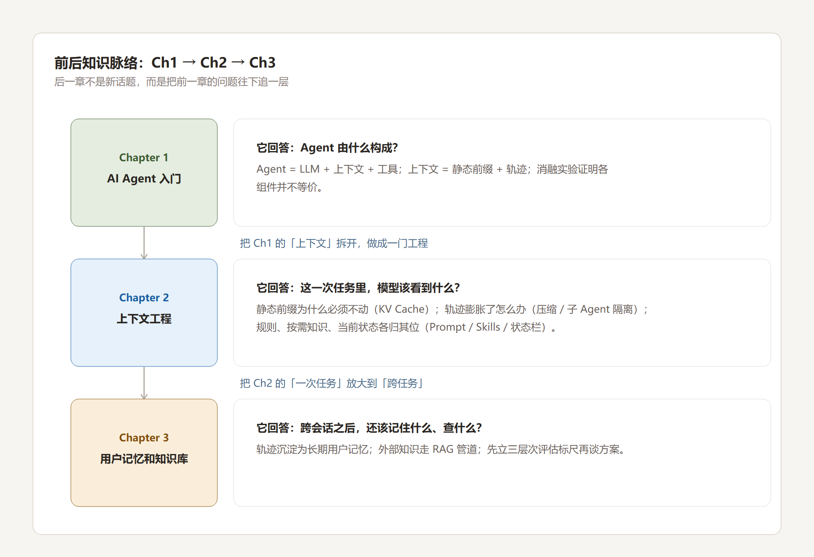
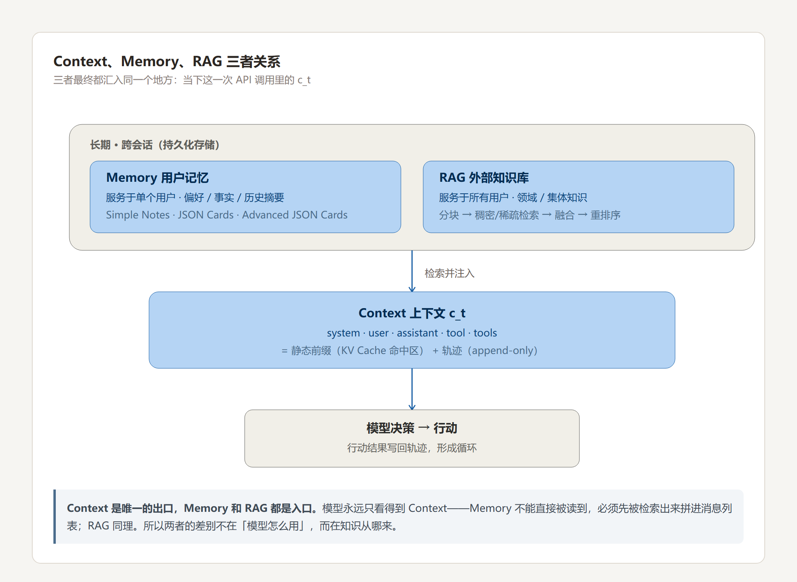
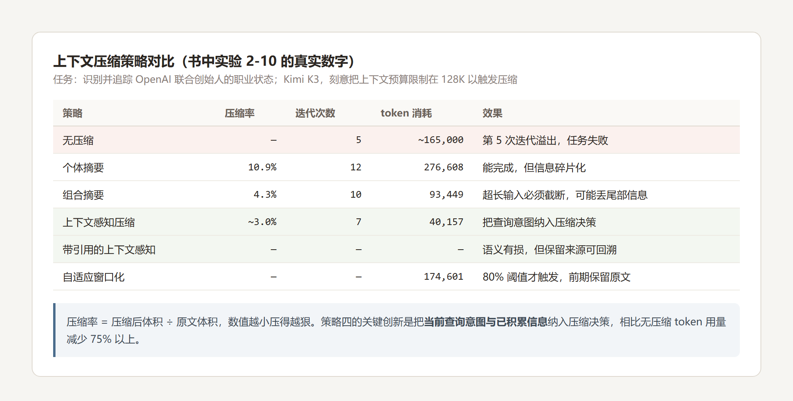
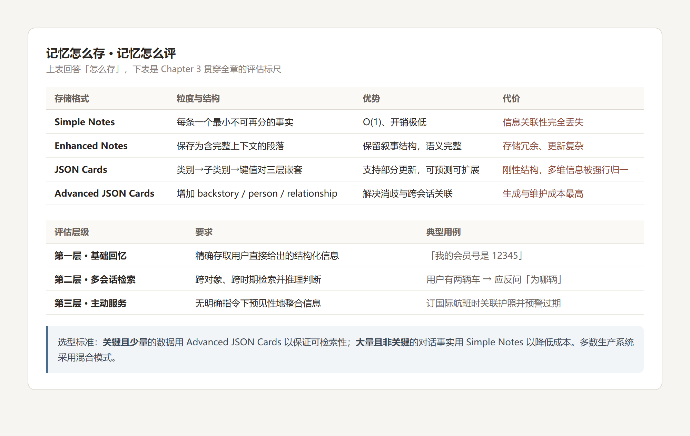

# Task1 学习记录：Chapter 2–3

> 只记**截图 + 分析**，不复述原文。
> Task0 已经跑过 Chapter 1 的消融实验，所以这份记录的重点是**新知识怎么接到旧知识上**。

## 0. 一句话

Chapter 2 解决「**这一次任务里**，模型该看到什么」；Chapter 3 解决「**跨会话之后**，还能记住什么、查什么」。
两者的地基都是 Chapter 1 的公式：**Agent = LLM + 上下文 + 工具**。

---

## 1. 承上：Chapter 1 留下了什么问题

分析：

- Chapter 1 给出了公式和结构，但没回答「结构里每一格具体怎么调」。Task0 的消融实验已经证明了**各组件并不等价**——抽掉工具定义和工具结果，Agent 就没有行动接口、没有闭环反馈。
- Chapter 2 接的正是「**静态前缀**」和「**轨迹**」这两格：静态前缀为什么必须不动、轨迹膨胀了怎么办。
- Chapter 3 接的是「轨迹」跨会话之后去哪。Task0 里我写「轨迹是 Agent 的唯一记忆」，Chapter 3 把这句话**限定**成了「本次会话的唯一记忆」——跨会话需要另建一层长期记忆。

→ 三章是一条线，不是三个并列的话题。

---

## 2. 打卡核心问题：Context、Memory、RAG 三者关系

三句话讲清：

1. **Context 是唯一的出口，Memory 和 RAG 都是入口。**
   模型永远只看得到上下文。Memory 不能直接被读到，必须先被检索出来、拼进消息列表；RAG 同理。
   所以两者的差别不在「模型怎么用」，而在**知识从哪来**——一个来自与用户的交互历史，一个来自外部语料。

2. **Memory 是「用户尺度的 RAG」，RAG 是「集体尺度的 Memory」。**
   Chapter 3 的主线正是这个：把服务外部知识库的检索技术**反过来**用于用户记忆（实验 3-9、3-11）。
   两者共用向量检索与知识压缩，也共用同样的麻烦——信息冲突、知识过期、检索不准。

3. **Context 管「表达」，Memory / RAG 管「沉淀」。**
   Chapter 2 的技术都在有限窗口内更聪明地表达信息；Chapter 3 的技术在窗口之外更可靠地沉淀信息。

一句总括：**Context 是工作台，Memory 是档案柜，RAG 是图书馆的检索台。**
工作台永远只有那么大，所以要把档案柜里用得上的那几页、图书馆里相关的那几本，及时摆到台面上——摆什么、怎么摆，就是上下文工程。

---

## 3. Chapter 2：压缩的真正动机不止「塞不下」

分析：

- 我原以为压缩就是为了「长度不够」。书里给了**三个**动机，后两个更容易被忽略：控制长度与成本、**提升思考质量**、**缓解上下文焦虑**。
- 机制上的关键判断是「**上下文学习本质是检索而非推理**」。注意力擅长「查找」（笼子 37 里是什么猫？），不擅长「统计归纳」（总共多少只黑猫？）。所以压缩的价值是：**把需要思考才能得到的结论，变成可以直接检索的知识。**
- 要区分两个近义词：**上下文溢出**（装不下了）vs **上下文腐化**（装得下但找不到了）。后者更隐蔽——Agent 表面还在正常工作，决策质量在悄悄下滑。
- 最漂亮的一手是「**隔离优于压缩**」：让大体积的中间信息**根本不进入**主上下文，子 Agent 只回传几百 token 的结论。压缩是有损的事后补救，隔离是事前绝缘。

---

## 4. Chapter 3：先立标尺，再谈方案

分析：

- 「**先确立评估标准，再讨论设计方案**」是这一章最值得学的方法论。三层次框架（基础回忆 → 多会话检索 → 主动服务）在动手设计之前就给出了判据，后面实验 3-1 / 3-9 / 3-11 才有一把统一的尺子。
- 四种存储格式是**粒度和结构复杂度的递进**，不是四个并列选项。选型标准很实用：关键且少量的数据用 Advanced JSON Cards 保证可检索性，大量且非关键的对话事实用 Simple Notes 降成本，生产系统多为混合模式。
- Advanced JSON Cards 解决的是**消歧**：同一条信息在不同情境下含义完全不同——「张医生」可能是用户自己的牙医，也可能是他父亲的心内科医生。脱离 backstory 与 relationship 就无法正确理解。

---

## 5. 前后知识是怎么接上的（本次最大的收获）

| Chapter 1 / Task0 里的概念 | 在 Chapter 2 / 3 里怎么接上 |
| --- | --- |
| **静态前缀**（Task0 里我理解为「可缓存的前缀」） | Ch2 给出机制：KV Cache 缓存的就是前缀的 K/V，前缀一变、其后全部失效。所以 `system` + `tools` 必须永远不动——**这不是风格建议，是架构约束** |
| **轨迹 append-only** | Task0 里它是「可缓存、可重放、可审计」的来源；Ch2 指出它**同时**是膨胀的来源。而压缩发生在两次 API 调用之间、且不动 `system` / `tools`——正好接回「静态前缀不能动」这条线 |
| **`no_history` 陷入循环**（Task0 实测 15 次重复调用） | Task0 证明了「不能没有轨迹」，Ch2 回答「轨迹太多怎么办」。**同一个问题的两半** |
| **「轨迹是 Agent 的唯一记忆」** | Ch3 修正为「轨迹是**本次会话**的记忆」，跨会话要另建用户长期记忆层。这是对 Task0 那句话的重要限定 |
| **`grounding.py` 以模型第一视角审计** | Ch3 把它延伸到防御：检索内容必须做来源标记，且不能让检索内容直接触发高风险操作（间接提示注入） |
| **「空消融」教训** | 直接迁移到 Ch3 的实验对比：对照没有真正生效时，指标「看起来无变化」，结论就无效。这次实验我正好踩到一次，见实验记录第 3.1 节 |
| **Harness 五要素** | Ch2 的 Prompt / Skills / 状态栏 / 压缩，全都是 Harness 里「上下文管理」那一格的展开 |

---

## 6. 还没搞清楚的

- [ ] **压缩阈值定多少？** 书里说「接近阈值时批量压」，实验 2-10 的策略六用的是 80%。这个数字可以推广吗？
- [ ] **Skills 的元认知难题**：模型不知道自己不知道什么，就无法正确触发 Skill 加载。
- [ ] **Memory 的冲突消解没有银弹**：实验 3-9 里「妻子设立转账 → 丈夫改金额 → 妻子改回来」说明，孤立分块的检索会看到三个各自独立又互相矛盾的有效指令。
- [ ] **间接提示注入的防御上限**：只要检索内容进了上下文，风险就没有归零。

---

## 相关笔记

- 上一期：[`task0-note.md`](../../task0-note.md)（实验 1-1 消融实验）
- 本期实验：[`../实验记录/实验记录.md`](../实验记录/实验记录.md)
- 原文出处：《深入理解 AI Agent》第 2、3 章 · <https://github.com/bojieli/ai-agent-book/tree/main>
