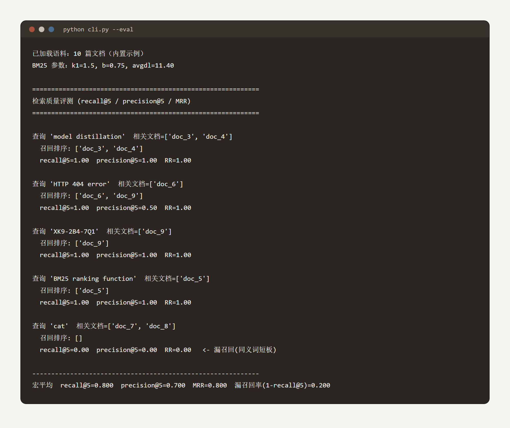
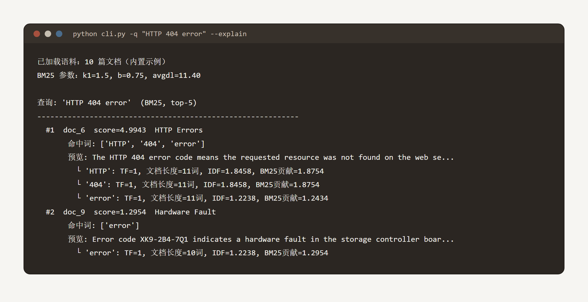
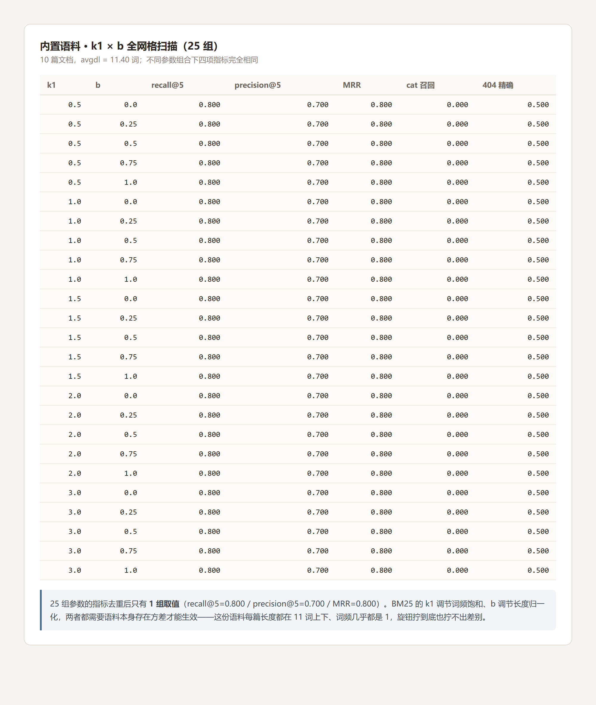
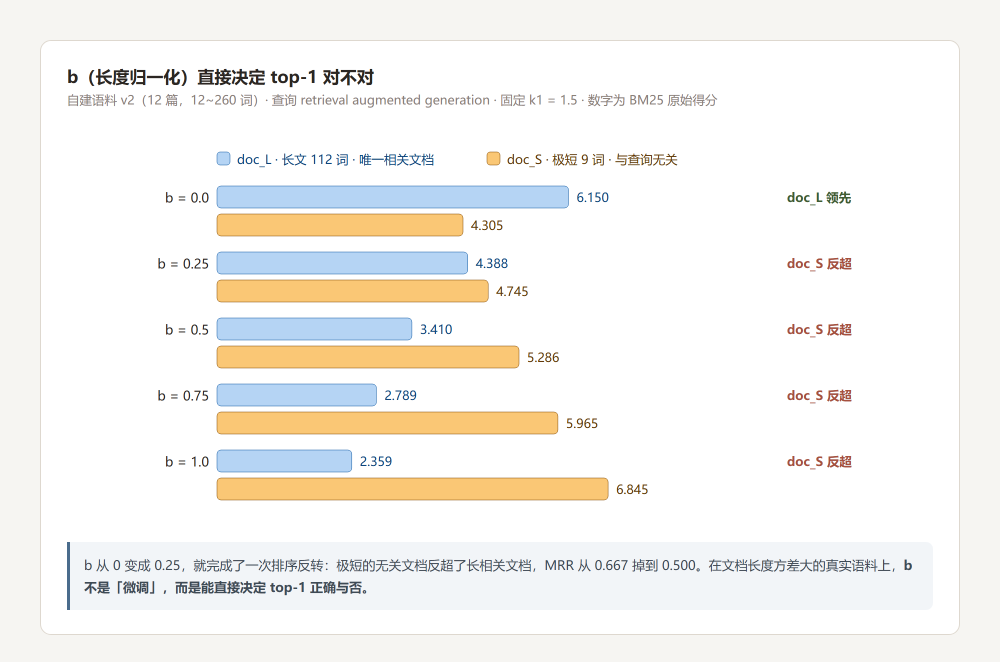
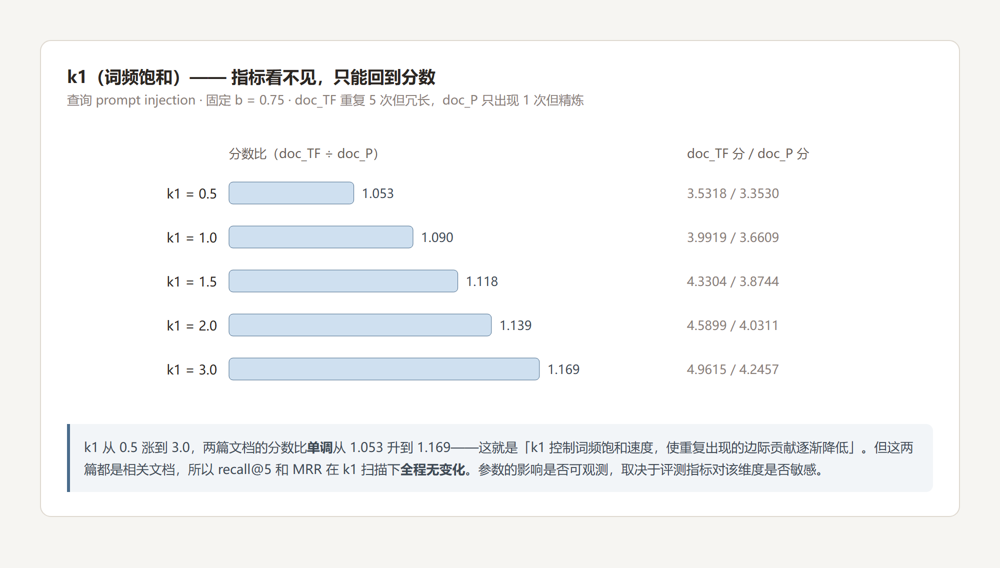
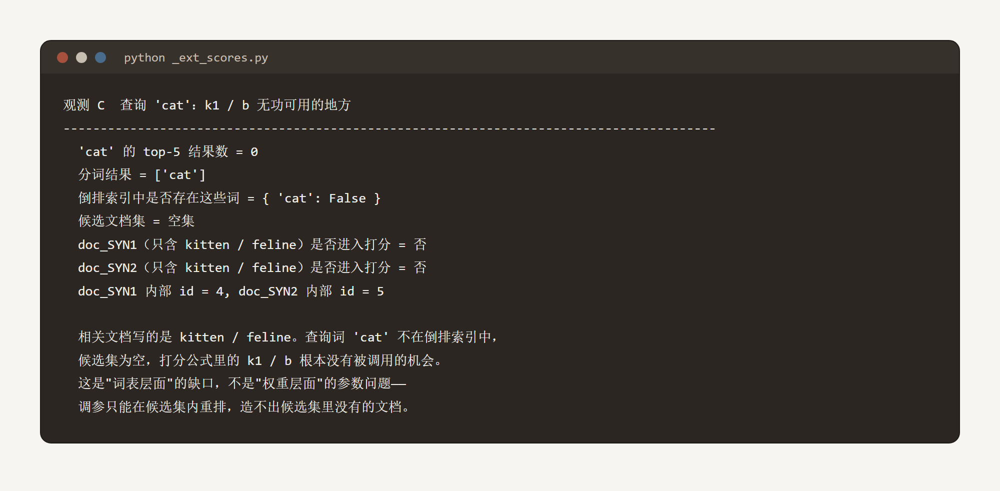

# Task1 实验记录：实验 3-5（从零实现 BM25 稀疏检索）

## 0. 为什么挑这个实验

Chapter 2 的实验多要 API Key 或本地模型（2-1 要 vLLM、2-2 要注意力可视化），Chapter 3 的多要嵌入模型或外部数据集。
而实验 3-5 的 `cli.py` **只依赖 Python 标准库、完全离线可跑**，还自带 recall / precision / MRR 标注评测集——**跑通成本最低，结论最硬**。
它也是理解「RAG 里的检索器到底在做什么」最直接的入口。

环境：Python 3.13.12 / Windows。代码从仓库按需拉取到 `chapter3/sparse-embedding/`，保持原有目录结构。

---

## 1. 基线：跑通检索质量评测



分析：

- 10 篇内置语料，`k1=1.5` / `b=0.75`，avgdl = 11.40 词。
- 宏平均 **recall@5 = 0.800 / precision@5 = 0.700 / MRR = 0.800**。
- `cat` 查询 **0 召回**——相关文档只写了 `kitten` / `feline`，从没出现过字面 `cat`。
- `HTTP 404 error` 的 precision 只有 0.50，因为 `error` 这个词把 Hardware Fault 那篇也带了进来。

→ **倒排索引命中的是词，不是意图。**

---

## 2. 稀疏检索的可解释性：打分能逐项归因



分析：

- `HTTP` 与 `404` 的 IDF 相同（都只出现在 1 篇文档），各贡献 **1.8754**。
- `error` 因为还出现在 doc_9 里，IDF 更低（1.2238），贡献 1.2434。
- doc_9 只命中 `error` 一个词，得分 1.2954，被甩到第二位。

→ 每个分数都能归因到具体的词。这是稀疏检索相对稠密检索的可解释性优势。

---

## 3. 扩展选做：修改检索参数，对比输出差异

### 3.1 第一轮 · 内置语料上扫 k1 × b，指标一个数字都不动



分析：

- 25 组参数组合（k1 ∈ {0.5, 1, 1.5, 2, 3} × b ∈ {0, 0.25, 0.5, 0.75, 1}），四项指标**去重后只有 1 组取值**。
- 原因很清楚：BM25 的 `k1` 调节词频饱和、`b` 调节长度归一化，**两者都需要语料本身存在方差才能生效**——这份语料每篇长度都在 11 词上下、词频几乎都是 1。

→ 这本身就是个教训：**在不具备相应结构的语料上扫参，得到的「稳定」是假象，不是鲁棒性。**

### 3.2 第二轮 · 构造长度差异大的语料，b 的作用立刻显形



分析：

- 自建 12 篇语料（12~260 词）。`doc_L` 是唯一相关文档（长文 112 词，查询词出现 2 次）；`doc_S` 与查询无关（极短 9 词，只顺带出现 1 次）。
- **b 从 0 变成 0.25，就完成了一次排序反转**：6.150 : 4.305 → 4.388 : 4.745，MRR 从 0.667 掉到 0.500。
- 到 b = 1.0 已经是 6.845 : 2.359 的碾压。

→ 在文档长度方差大的语料上，**b 不是「微调」，而是能直接决定 top-1 正确与否**。

### 3.3 第三轮 · k1 的作用真实存在，但指标完全看不见



分析：

- k1 从 0.5 涨到 3.0，两篇文档的分数比**单调**从 1.053 升到 1.169——量化了「k1 控制词频饱和速度，使重复出现的边际贡献逐渐降低」。
- 但这两篇都是相关文档，所以 **recall@5 和 MRR 全程无变化**。我是回到原始分数才看到这个效应的。

→ 这条比上一条更值钱：**效应是否存在是一回事，指标是否看得见是另一回事。**
用 recall@5 去找 k1 的效果，就像用体温计去量血压。

### 3.4 同义词缺口：调参救不了



分析：

- `cat` 在**全部 25 组参数下恒为 0 召回**。
- 查询词不在倒排索引中 → **候选集为空** → 打分公式里的 k1 / b 根本没有被调用的机会。

→ **调参只能在候选集内重排，造不出候选集里没有的文档。**
这直接指向实验 3-6 的混合检索——稠密通道才能补齐同义表达。

---

## 4. 结论对照

| 观测 | 结论 | 对应正文 |
| --- | --- | --- |
| 内置语料扫参无变化 | 参数生效需要数据本身有方差 | — |
| b: 0 → 0.25 排序反转 | b 控制长度归一化，能直接决定 top-1 | 「$b$ 控制长度归一化强度」 |
| k1: 分数比 1.053 → 1.169 单调 | k1 控制词频饱和速度 | 「$k_1$ 控制词频饱和速度」 |
| `cat` 恒 0 召回 | 词表层面的缺口，调参无法救 | 稀疏检索的同义短板 → 混合检索动机 |
| 指标与原始分数不一致 | 效应可见性取决于指标敏感性 | 「用 recall@k 等指标验收」 |

---

## 5. 和 Task0 的呼应

这次踩到的坑，和 Task0 学到的「**空消融**」是同一类错误：

> 当一个消融（或一次调参）没有真正作用到任何东西时，它的结果不能用来说明任何事。

- Task0 里：模型不产 `reasoning_content`，所以「去掉思考」那一组什么也没去掉。
- 这里：语料不具备长度方差，所以「改长度归一化」什么也没改。

**两次都是「操作没生效」，而不是「结论成立」。**

---

## 6. 下一步

- [ ] 跑实验 3-6（`retrieval-pipeline`），把 `cat` 这条用例丢进混合管线，验证稠密通道能否把它捞回来
- [ ] 换一份真实的业务语料（有长度方差、有同义表达）重跑参数扫描，看最优 k1 / b 落在哪
- [ ] 试 `--method splade`（学习型稀疏检索）：需下载 `naver/splade-cocondenser-ensembledistil`，本次未做

---

## 复现命令

```bash
cd chapter3/sparse-embedding

python cli.py                                      # 默认演示
python cli.py --eval                               # 检索质量评测
python cli.py -q "HTTP 404 error" --explain        # 逐词 TF/IDF/BM25 贡献
python cli.py --k1 2.0 -b 0.5 -q "model distillation"
python cli.py -q "cat"                             # 观察同义词短板
```

> 说明：本目录下的参数扫描与图表来自自建语料与自定义脚本，
> 其中「语料 v2」的全部数字用于演示 BM25 参数机制，**不是书中给出的官方实验结果**。

---

## 相关笔记

- 上一期：[`task0-note.md`](../../task0-note.md)（实验 1-1 消融实验）
- 本期学习记录：[`../学习记录/学习记录.md`](../学习记录/学习记录.md)
- 配套代码：<https://github.com/bojieli/ai-agent-book/tree/main/chapter3/sparse-embedding>
