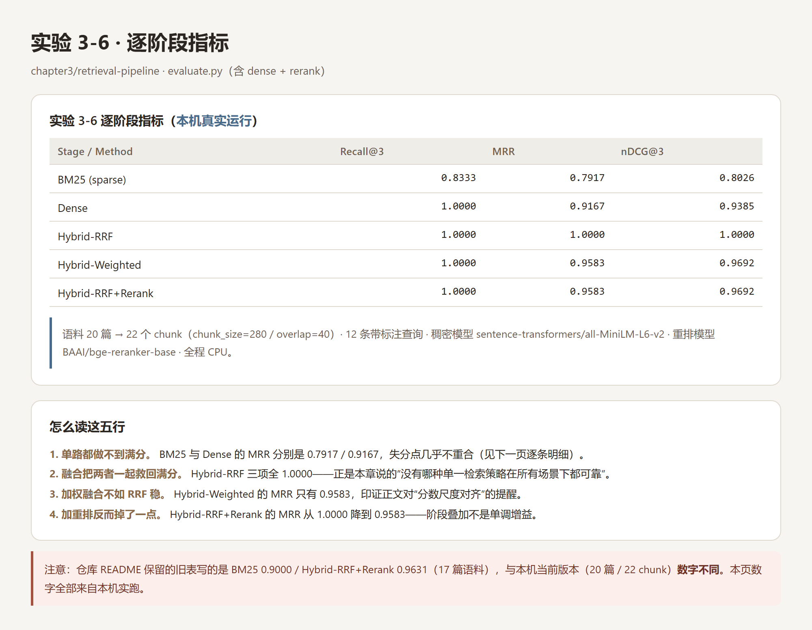
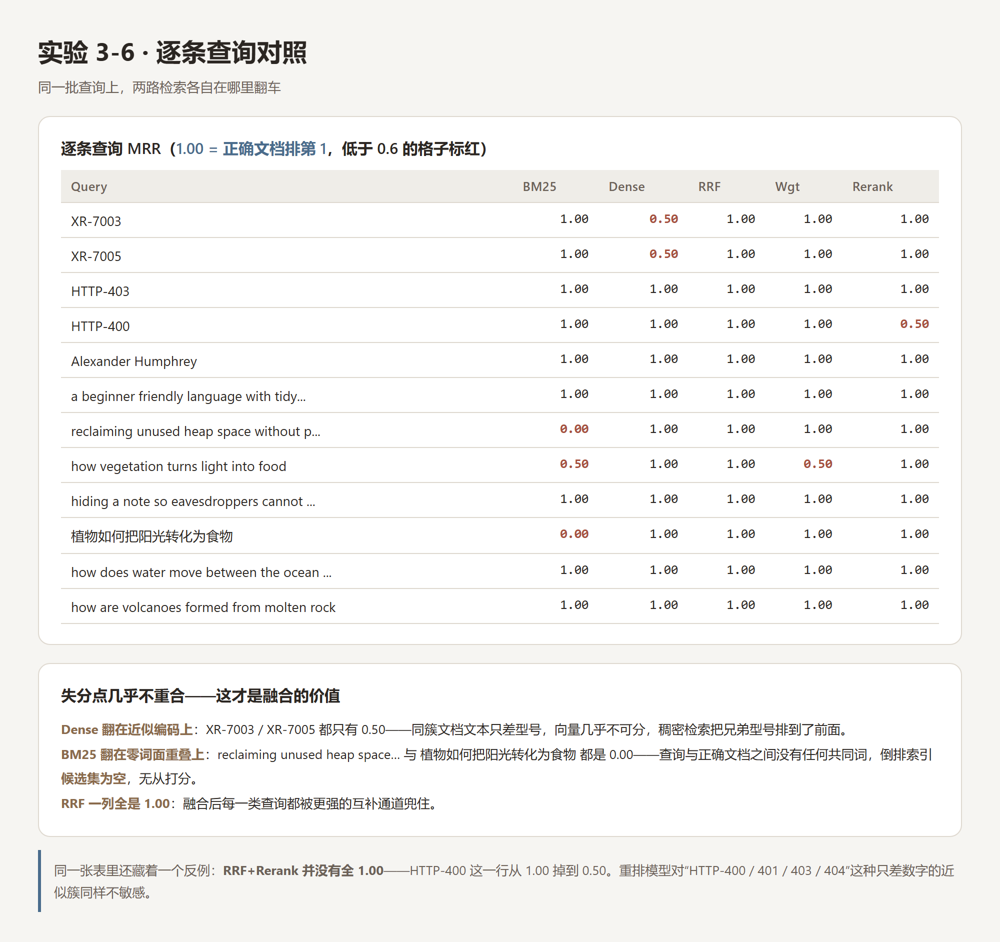
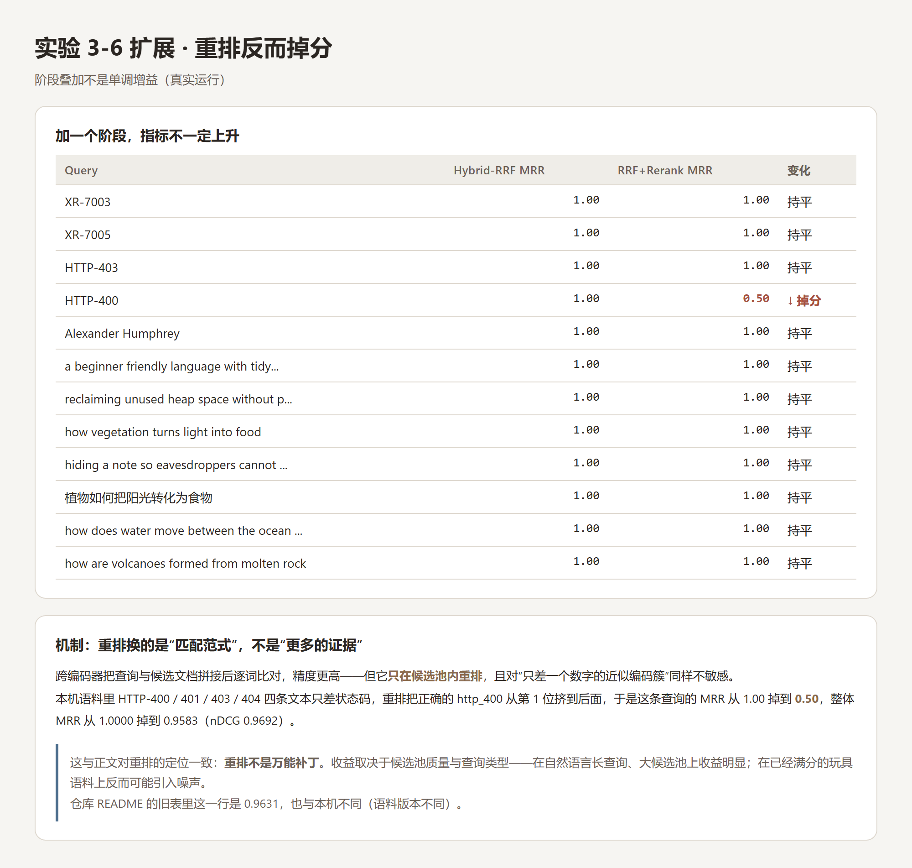
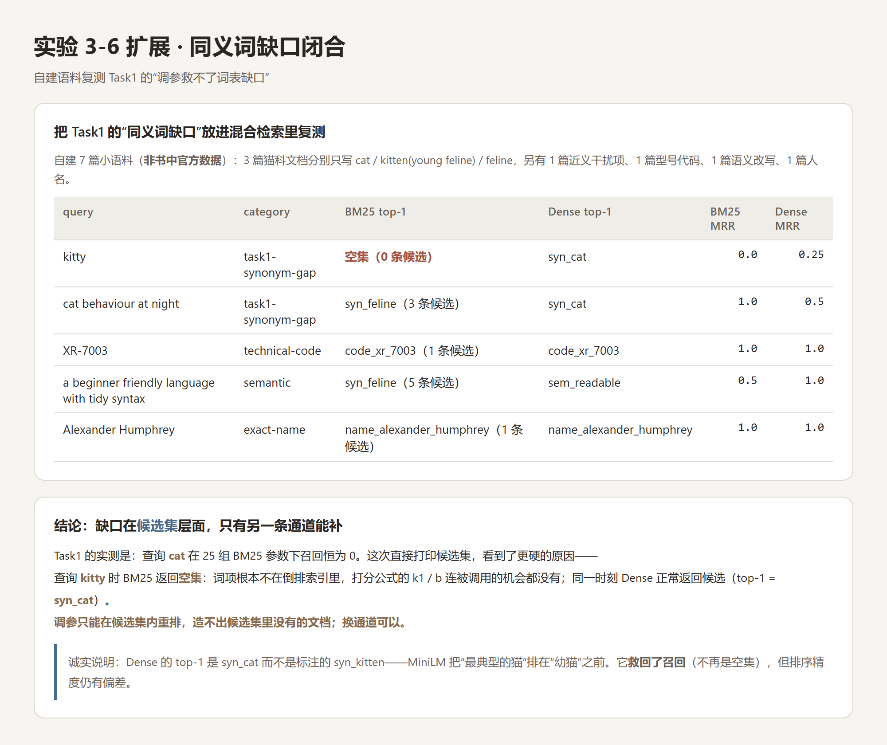
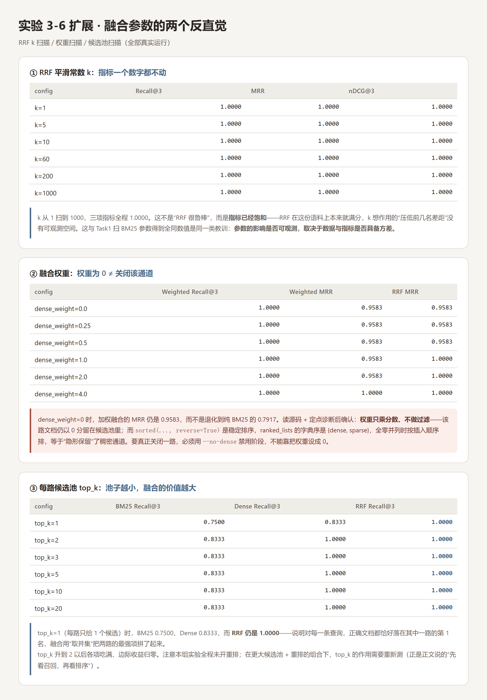
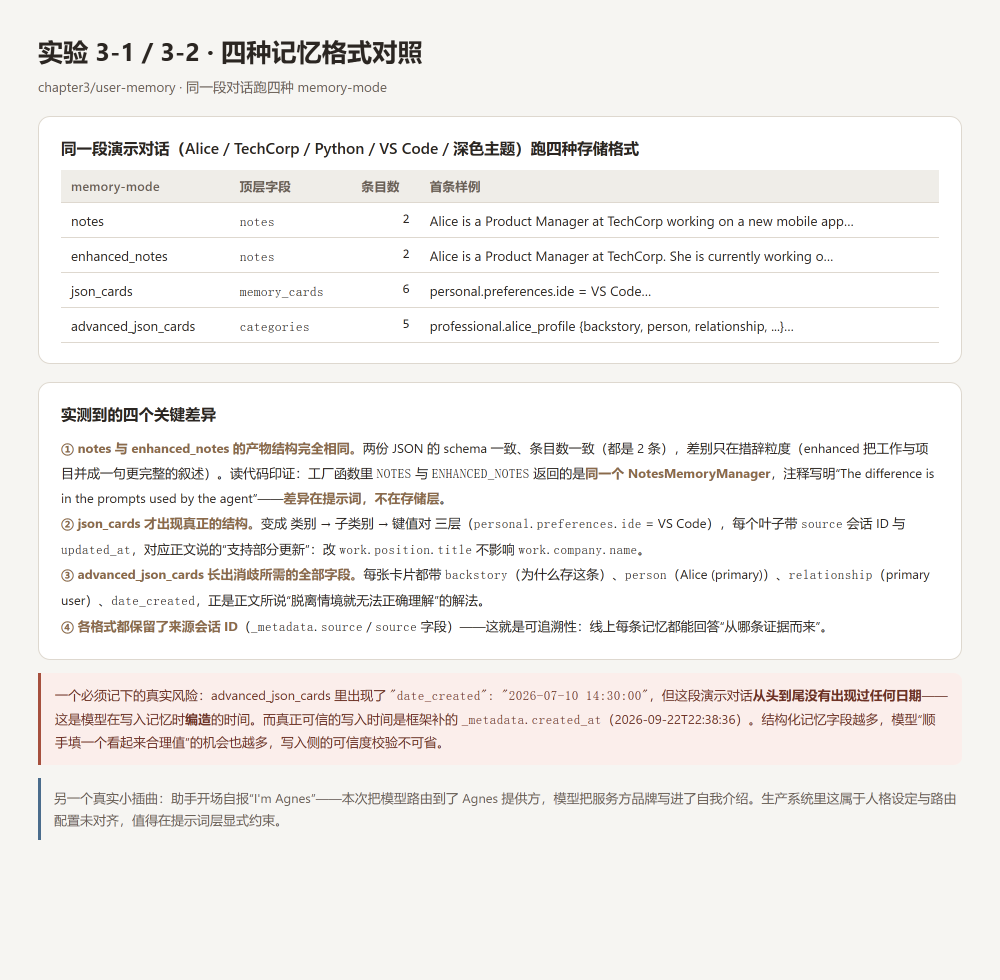

# Task2 实验记录 · Chapter 3

> 共读《深入理解 AI Agent：设计原理与工程实践》第 3 章
> 实验日期：2026-09-22　｜　运行环境：Windows + Python 3.13（CPU）
> **本页所有数字均来自本机真实运行**；凡与仓库自带结果不一致处，均已显式标注。

---

## 0. 本期跑了什么

| 实验 | 项目 | 跑法 | 说明 |
| :--: | :-- | :-- | :-- |
| **3-6** | `chapter3/retrieval-pipeline` | `evaluate.py`（单进程：分块 → 稀疏 → 稠密 → 融合 → 重排） | **主实验**：逐阶段指标 + 逐条查询对照 |
| 3-6 扩展 | 同上 | 自建语料 + 参数扫描（RRF k / 融合权重 / 候选池 top_k） | 闭合 Task1 的「同义词缺口」结论 |
| **3-1 / 3-2** | `chapter3/user-memory` | `main.py --mode demo`，同一段对话跑 4 种 memory-mode | **记忆侧主实验**：四种存储格式对照 |

**为什么选它们**：Task1 已经跑过 3-5（BM25 从零实现），当时的结论「调参救不了词表缺口，得靠混合检索」正好由 3-6 来接；而任务名里的另一半「用户记忆」，由 3-1/3-2 的四种存储格式来覆盖。两个实验一个离线可跑、一个只依赖一次 LLM 调用，成本都可控。

---

## 1. 环境与复现方式

```bash
# 依赖（装进托管 Python，未污染系统环境）
rank_bm25 / jieba           # 3-6 的稀疏检索
torch 2.14.0+cpu / transformers 5.17.0   # 3-6 的稠密与重排（CPU 版）
openai / pydantic / rich / pyyaml / python-dotenv   # user-memory

# 3-6：完全离线（BM25 路径）
python evaluate.py --no-dense --no-rerank

# 3-6：完整流水线（稠密 + 重排），首次需下模型
python evaluate.py --output result_rerank.json

# 3-1/3-2：四种记忆格式
python main.py --mode demo --memory-mode notes                 --provider dashscope --model agnes-2.5-flash
python main.py --mode demo --memory-mode enhanced_notes        --provider dashscope --model agnes-2.5-flash
python main.py --mode demo --memory-mode json_cards            --provider dashscope --model agnes-2.5-flash
python main.py --mode demo --memory-mode advanced_json_cards   --provider dashscope --model agnes-2.5-flash
```

| 项 | 取值 |
| :-- | :-- |
| 稠密模型 | `sentence-transformers/all-MiniLM-L6-v2`（约 90MB，英文为主） |
| 重排模型 | `BAAI/bge-reranker-base`（交叉编码器） |
| LLM | Agnes AI（OpenAI 兼容聚合站），`agnes-2.5-flash`，走 `DASHSCOPE_BASE_URL` 覆盖 |

> 本机两个已踩过的坑：① HuggingFace 直连不稳，需 `HF_ENDPOINT=https://hf-mirror.com`；② 直接调 `chrome --screenshot` 在本机静默失败（返回 0 但不产出文件），截图改用 CDP（`--remote-debugging-port` + WebSocket）。

---

## 2. 主实验：实验 3-6 逐阶段指标



| Stage / Method | Recall@3 | MRR | nDCG@3 |
| :-- | --: | --: | --: |
| BM25 (sparse) | 0.8333 | 0.7917 | 0.8026 |
| Dense | 1.0000 | 0.9167 | 0.9385 |
| **Hybrid-RRF** | **1.0000** | **1.0000** | **1.0000** |
| Hybrid-Weighted | 1.0000 | 0.9583 | 0.9692 |
| Hybrid-RRF+Rerank | 1.0000 | 0.9583 | 0.9692 |

语料 20 篇 → 22 个 chunk（chunk_size=280 / overlap=40），12 条带标注查询，评测截断 k=3。

**三点值得记的读法**：

1. **单路都做不到满分，而且失分点不重合**——这是本章「没有哪种单一检索策略在所有场景下都可靠」最直接的证据。
2. **融合把两者一起救回满分**，Hybrid-RRF 三项全 1.0000。
3. **加权融合比 RRF 弱、重排甚至让 MRR 掉了一点**——阶段叠加不是单调增益，下面单独展开。

> ⚠️ **与仓库自带结果不一致，如实标注**：仓库 README 保留的旧表写的是 BM25 0.9000 / Dense 1.0000 / Hybrid-RRF+Rerank 0.9631（对应 17 篇语料）。本机当前版本是 20 篇文档 / 22 chunk，因此数字不同。**本页全部为本机实跑，未对照旧结果。**

### 2.1 逐条查询：两路各自在哪里翻车



| Query | BM25 | Dense | RRF | Wgt | Rerank |
| :-- | --: | --: | --: | --: | --: |
| XR-7003 / XR-7005 | 1.00 | **0.50** | 1.00 | 1.00 | 1.00 |
| HTTP-403 / HTTP-400 | 1.00 | 1.00 | 1.00 | 1.00 | 1.00 / **0.50** |
| Alexander Humphrey | 1.00 | 1.00 | 1.00 | 1.00 | 1.00 |
| a beginner friendly language… | 1.00 | 1.00 | 1.00 | 1.00 | 1.00 |
| reclaiming unused heap space… | **0.00** | 1.00 | 1.00 | 1.00 | 1.00 |
| how vegetation turns light into food | 0.50 | 1.00 | 1.00 | 0.50 | 1.00 |
| hiding a note so eavesdroppers… | 1.00 | 1.00 | 1.00 | 1.00 | 1.00 |
| 植物如何把阳光转化为食物 | **0.00** | 1.00 | 1.00 | 1.00 | 1.00 |
| how does water move… / volcanoes… | 1.00 | 1.00 | 1.00 | 1.00 | 1.00 |

- **Dense 翻在近似编码上**：XR-7003 / XR-7005 只有 0.50。同一簇文档文本只差型号，向量几乎不可分，稠密检索把**兄弟型号**排到了前面。
- **BM25 翻在零词面重叠上**：`reclaiming unused heap space…` 与中文查询都是 **0.00**。查询与正确文档没有任何共同词 → 倒排索引候选集为空 → 无从打分。
- **RRF 一列全是 1.00**：每一类查询都被互补的那条通道兜住。

### 2.2 反直觉发现：加一个阶段，指标反而掉



Hybrid-RRF 的 MRR 是 1.0000，加上重排后降到 **0.9583**（nDCG 0.9692）。唯一掉分的查询是 **HTTP-400：1.00 → 0.50**。

机制很清楚：重排用的是跨编码器，精度更高，但① **只能在候选池内重排**；② 对「HTTP-400 / 401 / 403 / 404」这种只差一个数字的近似簇**同样不敏感**，于是把正确的 http_400 从第 1 位挤了下去。

这与正文对重排的定位一致：**重排不是万能补丁**，它的收益取决于候选池质量与查询类型——在自然语言长查询、大候选池上收益明显；在已经满分的玩具语料上反而可能引入噪声。

---

## 3. 扩展选做：改语料 / 改参数

### 3.1 同义词缺口：把 Task1 的结论往下追一层



Task1 的实测结论是：查询 `cat` 在 25 组 BM25 参数下召回恒为 0，「调参只能在候选集内重排」。这次我构造了一份 7 篇的小语料（**非书中官方数据**）直接打印候选集，看到了更底层的原因：

| query | category | BM25 top-1 | Dense top-1 |
| :-- | :-- | :-- | :-- |
| **kitty** | task1-synonym-gap | **空集（0 条候选）** | syn_cat |
| cat behaviour at night | task1-synonym-gap | syn_feline（3 条候选） | syn_cat |
| XR-7003 | technical-code | code_xr_7003（1 条候选） | code_xr_7003 |
| a beginner friendly language… | semantic | syn_feline（5 条候选，全错） | sem_readable |
| Alexander Humphrey | exact-name | name_alexander_humphrey | name_alexander_humphrey |

查询 `kitty` 时 BM25 返回的是**空集**：词项根本不在倒排索引里，BM25 公式里的 k1/b **连被调用的机会都没有**；同一时刻 Dense 正常返回候选。

> **一句话结论：调参只能在候选集内重排，造不出候选集里没有的文档；换通道可以。**

诚实说明：Dense 的 top-1 是 `syn_cat` 而非标注的 `syn_kitten`——MiniLM 把「最典型的猫」排在「幼猫」之前。它**救回了召回**（不再是空集），但排序精度仍有偏差。

### 3.2 融合参数的两个反直觉



**① RRF 平滑常数 k：指标一个数字都不动。** k ∈ {1, 5, 10, 60, 200, 1000}，Recall@3 / MRR / nDCG@3 全程 1.0000。
这不是「RRF 很鲁棒」，而是**指标已经饱和**——RRF 在这份语料上本来就满分，k 想作用的「压低前几名差距」没有可观测空间。这与 Task1 扫 BM25 参数得到全同数值是同一类教训：**参数的影响是否可观测，取决于数据与指标是否具备方差。**

**② 融合权重：权重为 0 ≠ 关闭该通道。**

| dense_weight | Weighted Recall@3 | Weighted MRR | RRF MRR |
| --: | --: | --: | --: |
| 0.0 | 1.0000 | 0.9583 | 0.9583 |
| 0.25 / 0.5 | 1.0000 | 0.9583 | 0.9583 |
| 1.0 / 2.0 | 1.0000 | 0.9583 | 1.0000 |
| 4.0 | 1.0000 | 1.0000 | 1.0000 |

`dense_weight=0` 时，加权融合的 MRR 仍是 **0.9583**，而不是退化到纯 BM25 的 0.7917。读源码 + 定点诊断后确认了机制：

- `fusion.py` 里权重只**乘分数**、不做过滤：该路文档仍以 **0 分**留在候选池里；
- `sorted(..., reverse=True)` 是**稳定排序**，而 `ranked_lists` 的字典序是 `{dense, sparse}`；
- 于是全零并列时按插入顺序排 → 等于「隐形保留」了稠密通道。

**要真正关闭一路，必须用 `--no-dense` 禁用阶段，不能靠把权重设成 0。**

**③ 候选池 top_k：池子越小，融合的价值越大。**

| top_k | BM25 Recall@3 | Dense Recall@3 | RRF Recall@3 |
| --: | --: | --: | --: |
| **1** | 0.7500 | 0.8333 | **1.0000** |
| 2 / 3 / 5 / 10 / 20 | 0.8333 | 1.0000 | 1.0000 |

top_k=1（每路只给 1 个候选）时，两路单独都做不到满分，而 **RRF 仍是 1.0000**——说明每一条查询的正确文档都恰好落在其中一路的第 1 名，融合用「取并集」把两路最强项拼了起来。top_k 升到 2 之后边际收益归零（本组全程未开重排）。

---

## 4. 记忆侧实验：四种存储格式的真实产物



同一段演示对话（Alice / TechCorp / 产品经理 / 偏好 Python、VS Code、深色主题），用 4 个 `--memory-mode` 各跑一遍：

| memory-mode | 顶层字段 | 条目数 | 首条样例 |
| :-- | :-- | --: | :-- |
| notes | `notes` | 2 | Alice is a Product Manager at TechCorp working on a new mobile app… |
| enhanced_notes | `notes` | 2 | Alice is a Product Manager at TechCorp. She is currently working on… |
| json_cards | `memory_cards` | 6 | personal.preferences.ide = VS Code |
| advanced_json_cards | `categories` | 5 | professional.alice_profile {backstory, person, relationship, …} |

**实测到的四个关键差异**：

1. **`notes` 与 `enhanced_notes` 的产物结构完全相同。** 两份 JSON 的 schema 一致、条目数一致（都是 2），差别只在措辞粒度。读代码印证：工厂函数里 `NOTES` 与 `ENHANCED_NOTES` 返回的是**同一个 `NotesMemoryManager`**，注释写明「The difference is in the prompts used by the agent」——**差异在提示词，不在存储层**。
2. **`json_cards` 才出现真正的结构**：类别 → 子类别 → 键值对 三层，每个叶子带 `source` 会话 ID 与 `updated_at`，对应正文说的「支持部分更新」。
3. **`advanced_json_cards` 长出消歧所需的全部字段**：每张卡片带 `backstory`（为什么存这条）、`person`（Alice (primary)）、`relationship`（primary user）、`date_created`，正是正文「脱离情境就无法正确理解」的解法。
4. **各格式都保留了来源会话 ID**（`source` / `_metadata.source`）——这就是正文强调的可追溯性。

> **一个必须记下的真实风险**：`advanced_json_cards` 里出现了 `"date_created": "2026-07-10 14:30:00"`，但这段演示对话**从头到尾没有出现过任何日期**——这是模型在写入记忆时**编造**的时间。真正可信的写入时间是框架补的 `_metadata.created_at`（2026-09-22T22:38:36）。**结构化字段越多，模型「顺手填一个看起来合理的值」的机会也越多，写入侧的可信度校验不可省。**

另一个小插曲：助手开场自报「I'm Agnes」——本次把模型路由到了 Agnes 提供方，模型把服务方品牌写进了自我介绍。生产系统里这属于人格设定与路由配置未对齐。

---

## 5. 实验小节：结论 ↔ 正文对照

| 实测现象 | 结论 | 对应正文 |
| :-- | :-- | :-- |
| BM25 0.7917 / Dense 0.9167，失分点不重合 | 两条检索路线互补，非替代 | 「混合检索：两全其美的艺术」 |
| Hybrid-RRF 三项全 1.0000 | 融合产生统一候选池，取两路之长 | 融合阶段职责 |
| Hybrid-Weighted 0.9583 < RRF 1.0000 | 加权融合受分数尺度影响，不如 RRF 稳 | 「RRF 完全抛开原始得分，只有排名」 |
| RRF+Rerank 的 MRR 反降到 0.9583 | 重排只在候选池内重排，且对近似簇不敏感 | 「重排不替代融合」 |
| `kitty` 时 BM25 候选集为空 | 词表缺口在候选集层面，调参无法修复 | 稀疏检索的同义短板 |
| 权重=0 时零分文档仍占候选位 | 融合阶段「0 分文档」≠「未召回文档」 | ——（实现层发现，正文未展开） |
| top_k=1 时 RRF 仍满分 | 融合增益在候选池最小时最大 | 「先看召回，再看排序」 |
| RRF k 扫描数值全同 | 参数可见性取决于数据与指标的方差 | ——（与 Task1 同一教训） |
| notes 与 enhanced_notes 产物同构 | 两者差别在提示词不在存储层 | 四种存储格式 |
| advanced 卡片编造出 `date_created` | 写入侧需要可信度校验 | 「核验」环节不可省 |

---

## 6. 实验产物索引

**`chapter3/retrieval-pipeline/`**

| 文件 | 内容 |
| :-- | :-- |
| `out_01_bm25_only.txt` | 纯离线 BM25 基线（Recall@3 = 0.8333） |
| `out_02_dense_hybrid.txt` | 稠密 + 融合（无重排）逐阶段表 |
| `out_04_rerank.txt` / `result_rerank.json` | **完整五阶段**逐阶段表 + 逐条查询明细 |
| `out_ext_sweep.txt` / `scan_ext.json` | 扩展扫描：E0 基线 / E1 同义词缺口 / E2 RRF k / E3 权重 / E4 top_k |
| `out_diag_weight.txt` / `out_diag_weight2.txt` | 权重语义定点诊断（含手工调用 fuse 的对照） |
| `_ext_corpus.json` / `_ext_queries.json` | 自建 7 篇语料 + 5 条标注查询 |
| `_ext_sweep.py` / `_diag_weight*.py` | 复现脚本 |

**`chapter3/user-memory/`**

| 文件 | 内容 |
| :-- | :-- |
| `out_memory_<mode>.txt` × 4 | 四种 memory-mode 的完整运行日志 |
| `evidence_memory_<mode>.json` × 4 | 四种格式落盘后的真实记忆文件 |
| `scan_memory_modes.json` | 结构化汇总（返回码 / 产物 / 顶层字段） |
| `_run_memory_modes.py` | 四模式驱动脚本（含 500 重试） |

---

## 7. 数据来源与诚实标注

| 类别 | 来源 | 是否可直接引用 |
| :-- | :-- | :-- |
| 第 2–4 节全部指标与逐条明细 | 本机实跑（20 篇语料 / 22 chunk） | ✅ 可引用，但需注明语料版本 |
| 仓库 README 的旧表（BM25 0.9000 等） | 仓库自带，17 篇语料 | ⚠️ 与本机不一致，勿混用 |
| 3.1 节同义词语料（7 篇） | **本笔记自建** | ⚠️ 非书中官方结果，仅用于演示机制 |
| 第 4 节四种记忆格式产物 | 本机实跑，Agnes `agnes-2.5-flash` | ✅ 可引用，注意模型可复现性差异 |
| 「权重=0 不等于关闭通道」的机制 | 读 `fusion.py` 源码 + 定点诊断交叉验证 | ✅ 已验证 |
